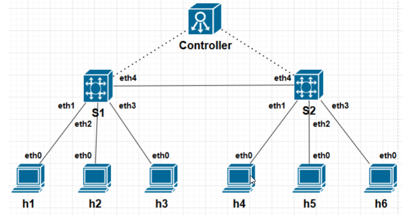

- 拓扑

  

- 启动

  - 将脚本放到虚拟机 路径

  ```
  /home/pany0593/13
  ```

  - 在mininet终端中打开h3 h4 h5 h6

  ```
  xterm h3 h4 h5 h6
  ```

  - 在h3 h5 h6中执行ddos.py

  ```
  python3 ddos.py
  ```

  - 在h4中执行ddos_host.py

  ```
  python3 ddos_host.py
  ```

- **注意记得关闭ddos再退出，否则后台服务不会关闭**

